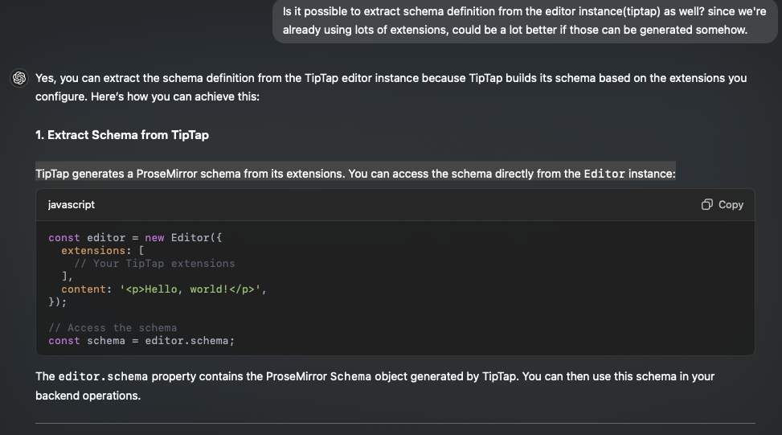

## Export ProseMirror Schema from Frontend



```ts
import { Editor } from '@tiptap/core';

const editor = new Editor({
  extensions: [
    // Your TipTap extensions here
  ],
  content: '<p>Hello, world!</p>',
});

// Access the schema
const schema = editor.schema;

// Extract nodes and marks from OrderedMap
const extractFromOrderedMap = (orderedMap) => {
  const result = {};
  orderedMap.forEach((key, value) => {
    result[key] = value;
  });
  return result;
};

const schemaDefinition = {
  nodes: extractFromOrderedMap(schema.spec.nodes),
  marks: extractFromOrderedMap(schema.spec.marks),
};

console.log(schemaDefinition);

// Send or save this `schemaDefinition` for backend use
```
